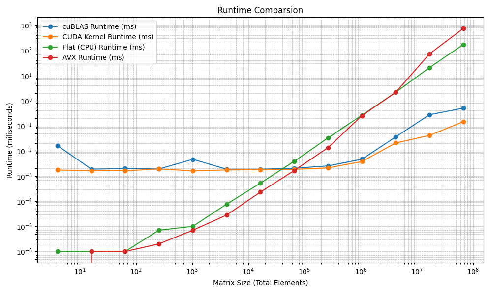

# cudavec

- Implementation of matrix multipication _(and few other operators)_ with CUDA
- All kernel functions are wrapped/can be wrapped in a helper function
- A lazy loading function `CudaContextInit()`, which speeds up the initial kernel call 4x at worst

## Menu

- [Quick Start](#quick-start)
- [CUDA Usage](#cuda-api-approach)
- [Benchmark Results](#benchmark-results)
- [Lazy Loading Improvements](#lazy-loading)

## Quick start

- (_It is suggested to use the Visual Studio 2022 CUDA project template for the setup_)

### MSVC + nvcc + CMake

#### Setup for MSVC + nvcc + CMake

- MSVC ```19.0.0 or higher```
- nvcc ```CUDA Runtime 12.0``` or higher
- GPU NVIDIA® GPU Geforce® 1000 series+ or NVIDIA® Workstation GPU series

#### Building & running the example for MSVC + nvcc + CMake

- build

```bash
cmake -B build -G "Visual Studio 17 2022" -S .
cmake --build build
```

- and run

```bash
./build/cudavec.exe
```

### gnu + nvcc + CMake (Linux only)

#### Setup for gnu + nvcc

- GNU ```g++ (GCC) 15.0.0```
- nvcc ```CUDA Runtime 12.0``` or higher
- GPU NVIDIA® GPU Geforce® 1000 series+ or NVIDIA® Workstation GPU series

```bash
sudo pacman -S nvidia nvidia-utils nvidia-settings
sudo pacman -S base-devel gcc cuda
```

#### Building & running the example for gnu + nvcc + CMake (Linux only)

- Run

```bash
cmake -B build -G "Unix Makefiles" -S .
cmake --build build
```

- and execute the binary

```bash
./build/cudavec
```

### MSVC + nvcc (Visual Studio)

#### Setup for MSVC + nvcc (Visual Studio)

- ```MSVC v142``` or higher
- ```CUDA Runtime 12.9``` or higher
- NVIDIA® GPU Geforce® 1000 series+ or NVIDIA® Workstation GPU series

#### Running the example for MSVC + nvcc (Visual Studio)

- Add the files to CUDA Project

- Simply build & run

### Usage

- Call the lazyloading function for better performance for the initial CUDA calls

```cpp
  CUDAContextInit();
```

- Initialize your vectors

```cpp
const unsigned int k = 5;
const unsigned int size = static_cast<unsigned int>(1) << k * 2;
const unsigned int dim = static_cast<unsigned int>(1) << k;

std::vector<float> A(size);
std::vector<float> B(size);
for (unsigned int i = 0; i < size; ++i) {
    A[i] = i;
    B[i] = i;
}
```

- Call the cuda matrix multiplication functions

```cpp
std::vector<float> res1;
{
    std::clog << "CUDA matrix multiplication total time:" << endl;
    benchmark::Timer<float> timer;
    res1 = matmul_cuda(A.data(), B.data(), dim, dim, dim);
}
```

- or any other cuda arithmetic wrapper functions

```cpp
std::vector<float> res1;
{
    std::clog << "CUDA addition total time:" << endl;
    benchmark::Timer<float> timer;
    res1 = performOperator(A, B, addKernel);
}
```

```cpp
std::vector<float> res1;
{
    std::clog << "CUDA addition total time:" << endl;
    benchmark::Timer<float> timer;
    res1 = performOperator(A, 5, addKernel);
}
```

## CUDA API Approach

```cpp
 // Device pointers are set
 Ty_* dev_a = nullptr, * dev_b = nullptr;

 // Vector sizes are calulcated
 size_t size_a = M * K;
 size_t size_b = K * N;

 // Pinned memory pointer is used to remove the overhead of retrivial of kernel return
 Ty_* c = nullptr;
```

- Pinned memory usage will of course consume a lot of RAM and the memory availability depends on the system. A switch will be implemented.

```cpp
 // Streams for async allocation, copy etc.
 cudaStream_t stream;
 
 cudaStatus = cudaStreamCreate(&stream);
 
 cudaMallocAsync(&dev_a, size_a * sizeof(Ty_), stream);
 cudaMallocAsync(&dev_b, size_b * sizeof(Ty_), stream);

 // a section RAM is allocated for shared usage between CPU & GPU
 cudaMallocHost(&c, M * N * sizeof(Ty_));

 cudaStatus = cudaMemcpyAsync(dev_a, a, size_a * sizeof(Ty_), cudaMemcpyHostToDevice, stream);


 cudaStatus = cudaMemcpyAsync(dev_b, b, size_b * sizeof(Ty_), cudaMemcpyHostToDevice, stream);
```

```cpp
 // Kernel launch configuration is not dynamic but decent enough 
 // 1024 is usually the maximum threads allowed across NVIDIA GPUs
 unsigned int blocksPerGrid = 1024;
 unsigned int threadsPerBlock = 1024;
 matmul_kernel << <blocksPerGrid, threadsPerBlock, 0, stream >> > (dev_a, dev_b, c, M, N, K);
```

## Benchmark Results

- Even matrices of varying size are multiplied
- Each calculation is timed with it's wrapper function
- All matrix multiplication results are correct and can be verified
 ```test_matrix_multiplication_correctness<typename>([control size])```

- _Note: for floating-point vectors sensitivity is adjusted whilst comparing_

### Specs

- GPU: Intel I9-14900HX
- GPU: RTX 4060 Mobile

### Configuration

- CUDA Toolkit Version 12.9
- Compiler: MSVC + nvcc
- Launch configuration: Release mode
- ```/O2``` and ```-use_fast_math``` enabled



```bash
Testing: 1024x1024.
cublas total time:
Duration(ms): 4ms
Duration(ns): 4109600ns

cuda total time:
Duration(ms): 3ms
Duration(ns): 3454100ns

Flat total time:
Duration(ms): 324ms
Duration(ns): 324432192ns

AVX total time:
Duration(ms): 263ms
Duration(ns): 263579904ns
```

- 80x speed up on GPU compared to CPU and 18x compared to AVX Instructions
- Comparable performance with CUBLAS

### Lazy Loading

- With lazy loading (1024 x 1024 matrices)

```bash
CUDA:
Duration(ms): 7ms
Duration(ns): 7033400ns
CUDA:
Duration(ms): 6ms
Duration(ns): 6937900ns
```

- Without lazy loading (1024 x 1024 matrices)

```bash
CUDA:
Duration(ms): 77ms
Duration(ns): 77046496ns
CUDA:
Duration(ms): 7ms
Duration(ns): 7368700ns
```
