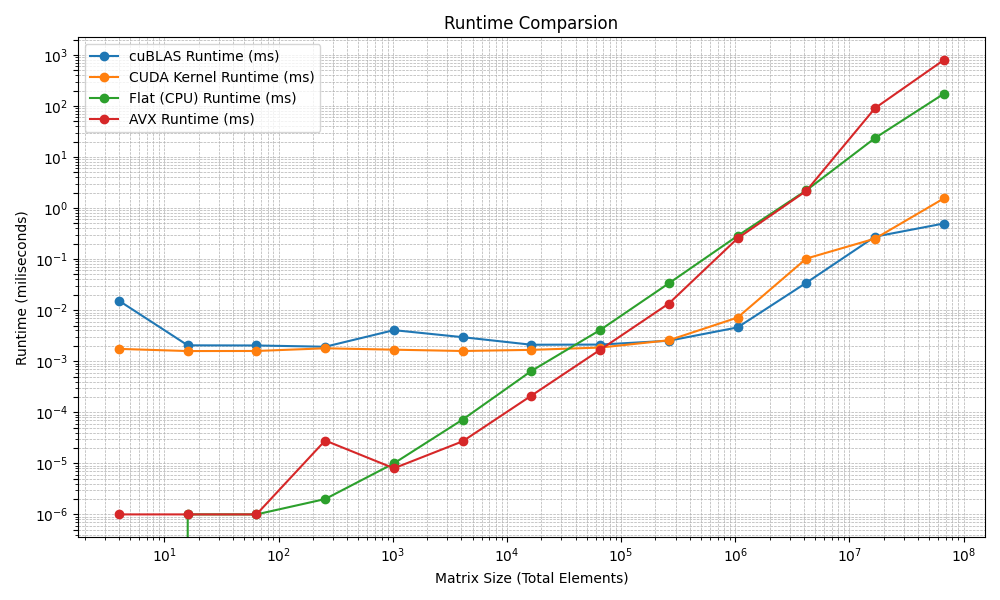

# cudaVec
- Implementation of matrix multipication with CUDA
- All kernel functions are wrapped/can be wrapped in a helper function
- All functions are templated
- Has a lazy loading function called `CudaContextInit()`, which speeds up the initial kernel calls 4x at worst
## Benchmark Results
- All matrix multiplication results are correct and can be verified calling this function
 ```test_matrix_multiplication_correctness<typename>([control size])```

### Specs:
- GPU: Intel I9-14900HX
- GPU: RTX 4060 Mobile
- Launch configuration: Release mode
- ```/O2``` and ```-use_fast_math``` enabled


#### (More results)
```cpp
Element size:1048576 || Dimensions: 1024x1024
AVX:
Duration(ms): 455ms
Duration(ns): 455705088ns

CUDA:
Duration(ms): 25ms
Duration(ns): 25189900ns

CPU:
Duration(ms): 2080ms
Duration(ns): 2080368256ns
```
- 80x speed up on GPU compared to CPU and 18x compared to AVX Instructions even on debug mode
#### Release Mode
```cpp
Element size:1048576 || Dimensions: 1024x1024
AVX:
Duration(ms): 282ms
Duration(ns): 282751296ns

CUDA:
Duration(ms): 7ms
Duration(ns): 7432400ns

CPU:
Duration(ms): 298ms
Duration(ns): 298425216ns
```
## Lazy Loading Improvements
- With lazy loading (1024 x 1024 matrices)
```cpp
CUDA:
Duration(ms): 7ms
Duration(ns): 7033400ns
CUDA:
Duration(ms): 6ms
Duration(ns): 6937900ns
```
- Without lazy loading (1024 x 1024 matrices)
```cpp
CUDA:
Duration(ms): 77ms
Duration(ns): 77046496ns
CUDA:
Duration(ms): 7ms
Duration(ns): 7368700ns
```
